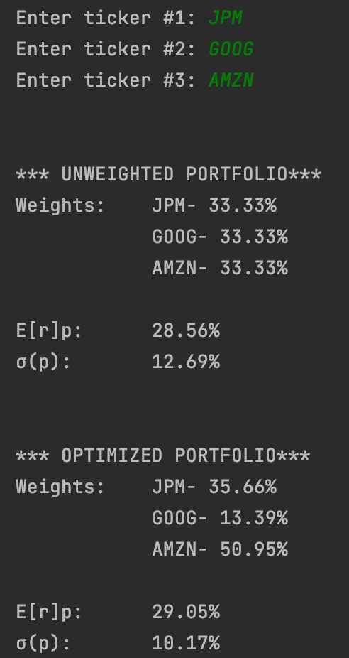

# PortfolioConstructor
 Three-stock portfolio optimizer created with python. It calculates the expected annual return and standard deviation of a portfolio using annual price data over the previous five years. It then finds the optimal stock weights to minimize risk. I started this project to learn more about portfolio theory and seek out attractive potential investments.  
\

In this example, the user inputs three stock tickers (must be listed on S&P 500). A balanced portfolio of these stocks is created and its expected annual return and corresponding standard deviation are calculated. Then, the Trust-Region Constrained optimization algorithm is performed to minimize portfolio standard deviation, which in essence cuts risk for the potential investor. The optimal weights and updated statistics are shown at the bottom of the output.
